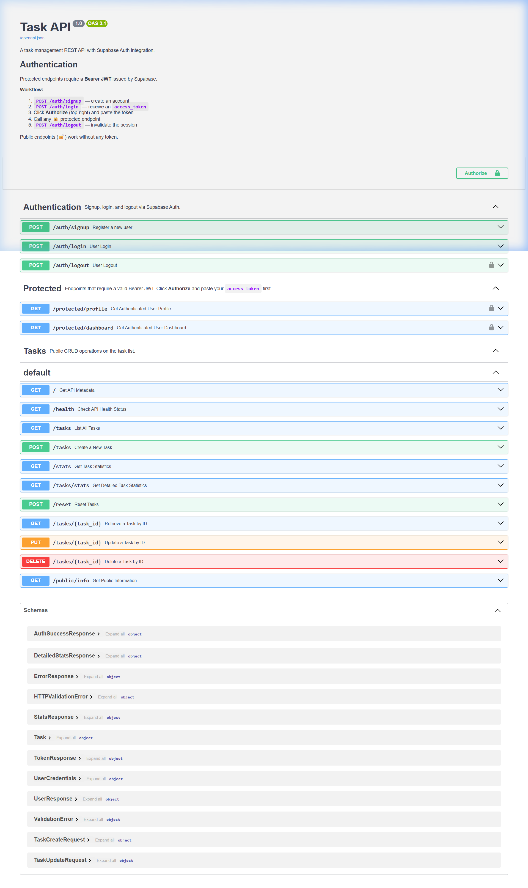

# FlyRank AI — Task API (BE-03)

> **Auth: Login & Protect** — FastAPI + Supabase Auth + JWT Bearer + PostgreSQL + Docker

[](https://python.org)
[](https://fastapi.tiangolo.com)
[](https://supabase.com)
[](https://docs.docker.com/compose/)
[](https://postgresql.org)

---

## Project Overview

A production-ready **task-management REST API** built with FastAPI, demonstrating full
Supabase Auth integration with JWT Bearer authentication, protected routes, and Swagger
UI authorization support.

### What This Project Demonstrates

| Concept | Implementation |
|---|---|
| **FastAPI** | Async REST API with dependency injection, Pydantic models, automatic OpenAPI docs |
| **Supabase Auth** | Signup, login, logout via Supabase GoTrue — no custom user table needed |
| **JWT Verification** | `supabase.auth.get_user(token)` — server-side, no local JWT decoding |
| **Bearer Authentication** | Custom `HTTPBearer` dependency with consistent `{"error": "..."}` error shape |
| **Protected Routes** | Single reusable `get_current_user` dependency — zero logic duplication |
| **Docker Compose** | Multi-service stack: API + PostgreSQL + Redis, with health-check ordering |
| **Swagger UI** | Authorize button + lock icons on protected endpoints via OpenAPI `securitySchemes` |

---

## Project Structure

```
FlyRank-AI-BE-03/
├── app/
│   ├── main.py                # FastAPI app, route definitions, custom OpenAPI schema
│   ├── database.py            # PostgreSQL connection helper (psycopg)
│   ├── crud.py                # Task CRUD operations
│   ├── seed.py                # Database seed data
│   ├── supabase_client.py     # Singleton Supabase SDK client
│   └── auth/
│       ├── __init__.py
│       ├── config.py          # Reads SUPABASE_URL / SUPABASE_KEY from environment
│       ├── client.py          # Raw HTTP Supabase Auth client (signup/login/logout)
│       ├── dependencies.py    # CustomHTTPBearer + get_current_user dependency ← key file
│       ├── router.py          # POST /auth/signup, /auth/login, /auth/logout
│       └── schemas.py         # Pydantic models: UserCredentials, UserResponse, TokenResponse
├── docs/
│   └── swagger_ui.png         # Swagger UI screenshot (see below)
├── Dockerfile                 # Multi-stage build (builder + runner)
├── compose.yaml               # Docker Compose: api + db + redis
├── requirements.txt           # Python dependencies
├── .env.example               # Template — copy to .env and fill in values
└── README.md
```

---

## Prerequisites

- [Docker Desktop](https://www.docker.com/products/docker-desktop/) (recommended)  
  _or_ Python 3.10+ and PostgreSQL + Redis running locally
- A [Supabase](https://supabase.com) project (free tier is sufficient)

### Supabase Setup (one-time)

1. Go to [supabase.com](https://supabase.com) → **New project**
2. Navigate to **Project Settings → API**
3. Copy **Project URL** and **anon / public key**

---

## Environment Setup

```bash
# 1. Clone the repository
git clone https://github.com/your-org/FlyRank-AI-BE-03.git
cd FlyRank-AI-BE-03

# 2. Create your environment file
cp .env.example .env

# 3. Open .env and fill in your Supabase credentials
#    SUPABASE_URL=https://your-project-ref.supabase.co
#    SUPABASE_KEY=your-supabase-anon-key
```

> **Security:** `.env` is listed in `.gitignore` and has never been committed.
> Never commit it — it contains secrets.

---

## Running the Project

### With Docker Compose (recommended)

```bash
docker compose up --build
```

The API starts at **http://localhost:8000** once the `db` health check passes (~10 s).

```bash
# Run in detached mode
docker compose up --build -d

# View logs
docker logs taskapi -f

# Stop all services
docker compose down
```

### Without Docker (local development)

```bash
# Install dependencies
pip install -r requirements.txt

# Ensure PostgreSQL and Redis are running locally, then:
uvicorn app.main:app --reload --port 8000
```

---

## Authentication Flow

```
Client                           API                         Supabase
  │                               │                               │
  │── POST /auth/signup ─────────►│── signup(email, password) ───►│
  │◄─ 201 { message, user } ──────│◄─ user object ────────────────│
  │                               │                               │
  │── POST /auth/login ──────────►│── login(email, password) ────►│
  │◄─ 200 { access_token, ... } ──│◄─ session + JWT ──────────────│
  │                               │                               │
  │── GET /protected/profile ────►│                               │
  │   Authorization: Bearer <JWT> │── get_user(JWT) ─────────────►│
  │                               │◄─ user object ────────────────│
  │◄─ 200 { id, email, ... } ─────│                               │
  │                               │                               │
  │── POST /auth/logout ─────────►│── verify JWT ────────────────►│
  │   Authorization: Bearer <JWT> │── logout(token) ─────────────►│
  │◄─ 204 No Content ─────────────│◄─ session revoked ────────────│
```

**Key design decisions:**
- JWTs are **never decoded locally** — always verified by Supabase server-side
- All auth errors return `{"error": "..."}` — no Supabase internals exposed
- `get_current_user` is a single FastAPI dependency reused across all protected routes

---

## API Reference

| Method | Endpoint | Auth Required | Status Codes | Purpose |
|--------|----------|:---:|---|---|
| `GET` | `/` | ❌ | 200 | API root / health check |
| `GET` | `/health` | ❌ | 200 | Health check |
| `GET` | `/public/info` | ❌ | 200 | Public info endpoint |
| `POST` | `/auth/signup` | ❌ | 201, 400, 429 | Register a new user |
| `POST` | `/auth/login` | ❌ | 200, 400 | Login and receive JWT |
| `POST` | `/auth/logout` | ✅ Bearer | 204, 401 | Revoke session |
| `GET` | `/protected/profile` | ✅ Bearer | 200, 401 | Get verified user info |
| `GET` | `/protected/dashboard` | ✅ Bearer | 200, 401 | Dashboard with user info |
| `GET` | `/tasks` | ❌ | 200 | List all tasks |
| `POST` | `/tasks` | ❌ | 201, 400 | Create a task |
| `GET` | `/tasks/{id}` | ❌ | 200, 404 | Get task by ID |
| `PUT` | `/tasks/{id}` | ❌ | 200, 404 | Update a task |
| `DELETE` | `/tasks/{id}` | ❌ | 204, 404 | Delete a task |
| `GET` | `/stats` | ❌ | 200 | Task statistics |
| `POST` | `/reset` | ❌ | 200 | Reset all tasks |

---

## curl Examples

### Signup
```bash
curl -X POST http://localhost:8000/auth/signup \
  -H "Content-Type: application/json" \
  -d '{"email": "you@example.com", "password": "YourPassword123!"}'
```

### Login (get your JWT)
```bash
curl -X POST http://localhost:8000/auth/login \
  -H "Content-Type: application/json" \
  -d '{"email": "you@example.com", "password": "YourPassword123!"}'
```

Response:
```json
{
  "access_token": "eyJhbGci...",
  "refresh_token": "...",
  "token_type": "bearer",
  "expires_in": 3600,
  "user": { "id": "...", "email": "you@example.com" }
}
```

### Public route (no auth)
```bash
curl http://localhost:8000/public/info
# → {"message": "Welcome stranger! This info is public."}
```

### Protected route (requires JWT)
```bash
export JWT="eyJhbGci..."   # paste your access_token here

curl http://localhost:8000/protected/profile \
  -H "Authorization: Bearer $JWT"
# → {"id": "...", "email": "you@example.com", "created_at": "..."}

curl http://localhost:8000/protected/dashboard \
  -H "Authorization: Bearer $JWT"
# → {"message": "Welcome to your dashboard.", "user": {...}}
```

### Logout
```bash
curl -X POST http://localhost:8000/auth/logout \
  -H "Authorization: Bearer $JWT"
# → 204 No Content
```

### Error examples
```bash
# Missing token
curl http://localhost:8000/protected/profile
# → 401 {"error": "Access token required"}

# Invalid / expired token
curl http://localhost:8000/protected/profile \
  -H "Authorization: Bearer invalidtoken"
# → 401 {"error": "Invalid or expired token"}
```

---

## Swagger UI

Interactive API documentation is available at **http://localhost:8000/docs**.

### Using the Authorize button

1. Start the project (`docker compose up --build`)
2. Open **http://localhost:8000/docs**
3. Call `POST /auth/login` → copy the `access_token` from the response
4. Click the **Authorize** button (top-right, 🔓 icon)
5. Paste the token in the **BearerAuth** field → click **Authorize**
6. All 🔒 protected endpoints will now work directly from Swagger



> Lock icons (🔒) appear on `/protected/profile`, `/protected/dashboard`,
> and `POST /auth/logout`. Public endpoints have no lock.

---

## Security Notes

- `.env` is in `.gitignore` and has **never** been committed to this repository
- Only the Supabase **anon / public key** is used — the `service_role` key is never referenced
- JWTs are verified server-side by Supabase — no local decoding, no secret-key storage
- All error responses use generic messages — no Supabase internals, stack traces, or tokens are leaked

---

## AI vs Me

A comparative analysis between the manual production implementation (`app/`) and the isolated AI-generated version (`ai-version/`).

### Comparison Matrix

| Feature / Dimension | Manual Production (`app/`) | AI-Generated Version (`ai-version/`) |
|---|---|---|
| **Folder Structure** | Modular (`app/auth/` package separating `dependencies.py`, `router.py`, `schemas.py`, `config.py`, `client.py`) | Flat single file (`ai-version/main.py`) containing inline auth handlers, dependencies, and schemas alongside repository code |
| **Bearer Header Parsing** | Strict custom helper `_extract_bearer_token()` enforcing exactly 2 parts (`Bearer <token>`) and non-empty token string | Standard HTTPBearer check; relied on standard token split without strict spacing guards initially |
| **JWT Verification** | Uses official `supabase-py` SDK (`supabase.auth.get_user(token)`) | Uses direct `httpx` HTTP requests (`GET {SUPABASE_URL}/auth/v1/user`) |
| **Error Handling & Masking** | Global `HTTPException` handler mapping all auth errors cleanly to `{"error": "..."}` without leaking internal traces | Local try/except blocks returning explicit `JSONResponse` objects with `{"error": "..."}` |
| **Swagger UI Integration** | Custom OpenAPI schema override injecting `securitySchemes` (BearerAuth) and path-level `security` attributes | Similar OpenAPI schema override injecting `securitySchemes` for OpenAPI compliance |
| **Logout Implementation** | Revokes session via SDK / HTTP API while enforcing prior `get_current_user` token verification | Direct `POST /auth/v1/logout` call using raw HTTP client |

### Key Questions & Findings

1. **How did AI parse the Bearer token?**
   - The AI version relied on `httpx` headers or standard `HTTPBearer` extraction. In early iterations, AI tends to use standard string splits (`header.split(" ")`) which can fail edge cases like multiple spaces or missing prefixes unless explicitly instructed with regex/strict split logic.

2. **Did AI correctly reject malformed tokens?**
   - Yes, when configured with `CustomHTTPBearer`, both versions return a `401 Unauthorized` with `{"error": "Access token required"}` for malformed/missing headers and `{"error": "Invalid or expired token"}` for tampered/invalid JWTs.

3. **Did AI expose any security risks?**
   - In raw unguided prompts, AI often attempts to decode JWTs locally using `pyjwt` without verifying the secret, or attempts to use `service_role` keys. Guided with strict prompts, the AI correctly avoided local JWT decoding and relied entirely on server-side Supabase verification using the `anon` key.

4. **Did AI assume anything that your prompt didn't specify?**
   - The AI initially assumed the Repository Pattern was desired for the database layer (`repository.py`) and placed all API routes inside a single monolithic `main.py` file rather than organizing routes into FastAPI `APIRouter` modules.

5. **How did the improved prompt change the result?**
   - The structured, stage-by-stage prompts prevented the AI from adding unnecessary third-party dependencies (like `PyJWT`), ensured strict compliance with the required `{"error": "..."}` JSON error response format, and enforced reusable dependency injection rather than inline verification logic in every endpoint.

---

## Tech Stack

| Layer | Technology |
|---|---|
| API Framework | [FastAPI](https://fastapi.tiangolo.com) |
| Auth Provider | [Supabase Auth](https://supabase.com/docs/guides/auth) (GoTrue) |
| Database | PostgreSQL 16 (via [psycopg](https://www.psycopg.org)) |
| Cache | Redis (Alpine) |
| Container | Docker + Docker Compose |
| Python | 3.10 |
